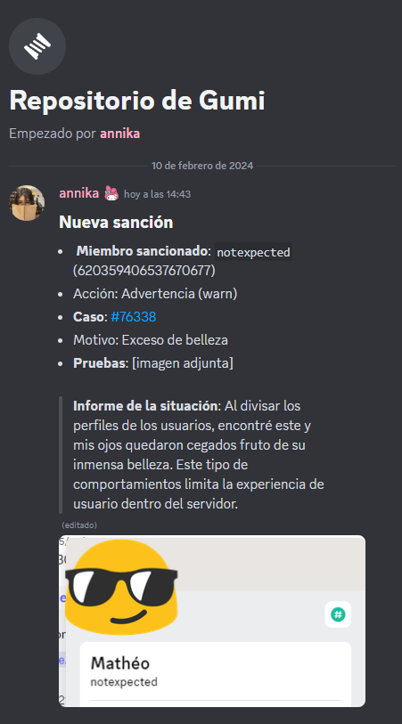

---
authors:
    - name: Mateo R.
      avatar: ../../media/avatar/mateo.jpg
---
<style>
    img {
    border-radius: 7px; 
    margin-top: 1%; 
    margin-bottom: 1%;
    max-width: 100%;
    float: left; /* Añade el float para alinear la imagen a la izquierda */
    margin-right: 10px; /* Espacio entre la imagen y el texto */
    }
</style>
## El problema de las sanciones con las pruebas... 
Siempre es un debate el hecho de cómo dejar constancia de la evidencia que hay detrás de cada movimiento por parte de los miembros del equipo.
Nosotros hemos decidido, dando un voto de fe, mantener en forma de contenido multimedia la información que comprometa a los afectados por la sanción. 

Cuando tengáis acceso al servidor para moderadores, se os creará un hilo (que llamamos _repositorio_) donde anotar todo lo mencionado:

### Es importante recordar que **todas las acciones dentro del servidor deben ser registradas manualmente por el ejecutor**

Para esto, usaremos la siguiente plantilla (que puede ser decorada a gusto del responsable, mientras no se produzca una omisión de información):

```diff
+ Miembro: Nombre de usuario sancionado + ID
+ Acción: Tipo de sanción (warn/mute/ban/...)
+ Caso #0000 (dependiendo del nro. que haya proporcionado el sistema)
- (opcional) Razón: es recomendable ponerlo, a pesar de no ser obligatorio.
+ Pruebas: [puedes incluir una breve explicación de lo que se aprecia en estas en el caso de que sea un archivo tedioso de ver]
- (opcional) Informe del suceso: a algunos moderadores les gusta agregar datos adicionales sobre lo ocurrido para facilitar el contexto.
```

A la hora de recopilar y almacenar, estamos respaldados por las leyes correspondientes de cada país, así como por el ejemplo en el caso de la Unión Europea, donde rige el Reglamento General de Protección de Datos (RGPD). Este contempla una serie de derechos a los que debemos obedecer mas no estamos obligados de informar.
El artículo legal aparece contemplado en [este apartado de las reglas del servidor](../reglas-del-servidor.md#grabación-de-contenido-y-persistencia-en-las-pruebas-para-efectuar-sanciones).
- Toda vuestra travesía en los canales de voz debe de ser grabada, para poder respaldar más tarde cualquier punición. Esto quiere decir que para aplicar una medida se debe de tener algo que certifique su imposición, es decir, la infracción de la regla correspondiente.
  - Para grabar recomendamos el uso de OBS, que es gratuito y de código abierto.
- Al servir en los canales de texto, se puede borrar un mensaje y luego hacer uso de los _logs_/registros que tenemos, de utilización privada para el equipo. 


==- <h4>Yendo a lo práctico:</h4>

===